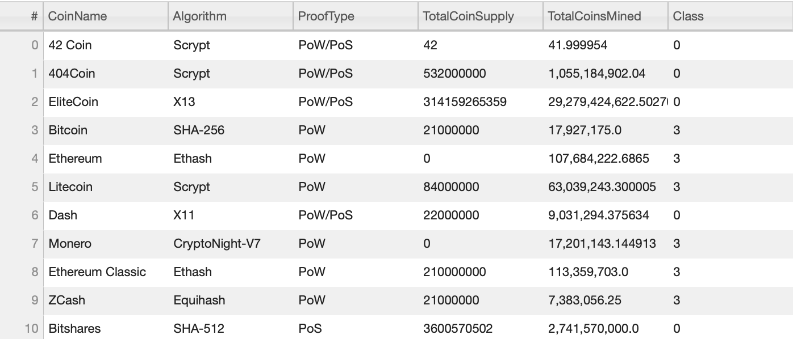
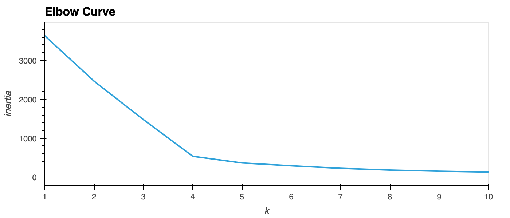
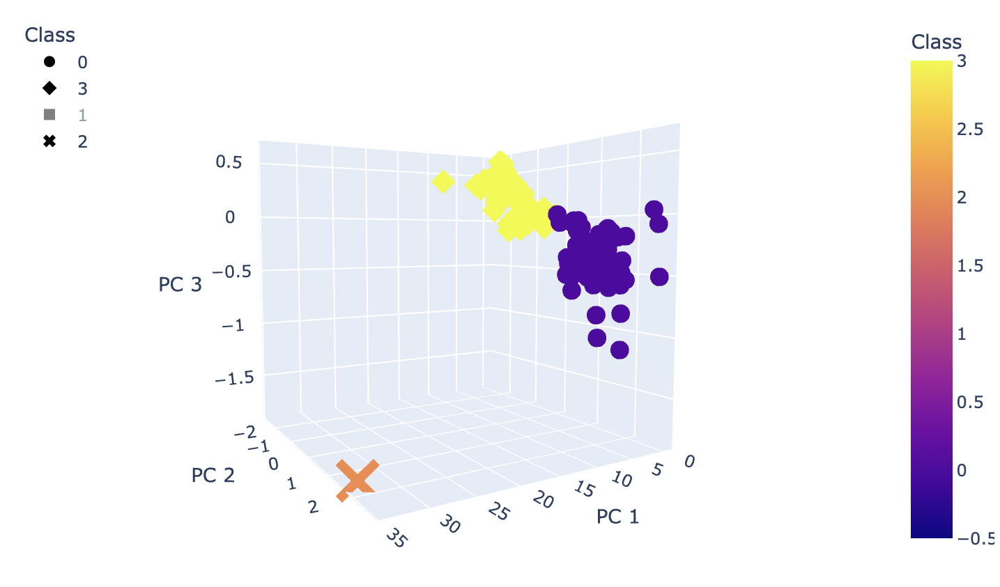

# Cryptocurrencies

## Overview

The purpose of this analysis is to use unsupervised machine learning to provide a breakdown of cryptocurrency trading data and use the findings as new investment potential.

To successfully analyze the data, the below aspects are used to provide effective results: 
* **Data Preprocessing** (Selection, Transformation, Scaling) - the process of helping to prepare data for `Machine Learning` Algorithms.
* **Elbow Curve** - method to determine the best number of clusters needed for the algorithm to group the objects by.
* **Principal Component Analysis (`PCA`)** - statistical technique to speed up machine learning algorithms when the number of features is too high.
* **Clustering Algorithms (`KMeans`)** - the process of grouping similar objects/data points into clusters.
* **Visualization (`hvPlot`, `Plotly`)** - graphic libraries that allows us to create 2D and 3D graphs such as, scatter plots.

## Results

The dataset originally contains 1,252 entries, however only 1,144 of those cryptocurrencies are current trading. The dataset was condensed further by removing any rows with null values, resulting in a total of 532 tradable cryptocurrencies to reference.

Using the `KMeans` algorithm, The Elbow Curve method shows the k value (the slope or number of clusters) at 4 with an inertia of 533.292.

The clusters are plotted in a 3D scatter plot for visualization.

## Resources
* Dataset from [CryptoCompare](https://min-api.cryptocompare.com/data/all/coinlist)
* Language: Python
* Tools: Jupyter Notebook
* Libraries: `Scikit-learn`, `Plotly`, `hvPlot`, `Pandas`
